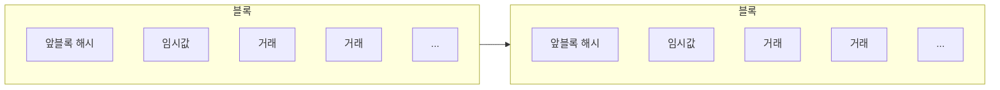

Bitcoin: P2P Electronic Cash System

> - <https://bitcoin.org/bitcoin.pdf>
> - <https://bitcoin.org/files/bitcoin-paper/bitcoin_ko.pdf>
> - 밑부터 시작하는 비트코인 (Programming Bitcoin by Jimmi Song, O'Reilly)
> - 리얼월드 암호학 - 데이비드 웡 저 임지순 역

- 순수한 P2P 전자화폐는 금융기관을 거치지 않고도 온라인 지불한 쪽에서 다른 쪽으로 직접 보낼 수 있게 해준다
- 비트코인은 P2P 네트워크를 이용한 이중지불(double-spending) 문제 해결책을 제시한다
  - 거래(transaction)을 작업증명 체인(proof-of-work chain)에 해싱 후 timestamp를 찍어, 변경할 수 없는 장부 기록

- 가장 긴 체인은 목격한 이벤트들의 순서에 대한 증명뿐만 아니라 그것이 가장 큰 CPU 파워 풀에서 나왔음에 대한 증명 역할도 한다.  
- 과반수의 컴퓨팅 파워가 공격에 협력하지 않는 노드에 의해 제어된다면 그들이 가장 긴 체인을 생성하고 공격자들을 앞지를 것이다. (51% 공격)

### Transactions

- 전자화폐(electronic coin)를 전자서명의 체인으로 정의한다.
- 이전 거래내역과 다음 소유자 공개키의 해시값을 전자적으로 서명하고, 이 정보를 화폐의 끝에 첨가함으로써 각 소유자는 화폐를 송금할 수 있다. 수취인은 소유권의 체인을 확인함으로써 서명을 검증할 수 있다.
- 이전 소유자가 과거에 다른 어떤 거래에도 서명하지 않았음을 수취인에게 알릴 방법이 필요하다.

### Timestamp Server

- 타임스탬프 서버는 타임스탬핑을 할 항목들의 블록에 대한 해시를 계산해 이를 신문이나 유스넷(Usenet) 포스트처럼 넓게 퍼뜨리는 방식을 동작한다.
- 타임스탬프는 해당 시점에 그 데이터가 해시 계산에 들어가기 위해서 명백히 존재했음을 증명해준다.
  - 각 타임스탬프는 이전 타임스탬프를 해시에 포함하여 각각의 추가 타임스탬프가 이전의 타임스탬프들을 보강 증명하는 체인을 형성한다.

- A의 잔고가 5코인이고 B, C한테 동시에 5코인을 전달한 경우
  - 해시는 시간적 순서를 의미

### Proof-of-Work

- 작업증명: SHA-256 같은 해시연산을 거쳐 만들어진 여러 개의 0 비트(zero bits)들로 시작하는 해시값을 확인
- 이 과정에서 필요한 평균 연산 작업은 결과값에 필요한 0 비트의 개수에 따라 지수적(exponential)으로 달라지며, 해시연산을 한 번 실행하는 것으로 검증된다.



- 작업증명은 기본적으로 CPU 당 1표
  - 다수결의 결과는 가장 많은 자원이 사용된 작업증명들의 가장 긴 체인이 됨
  - 정직한 노드에 의해 다수의 CPU 파워가 통제된다면, 가장 정직한 체인이 가장 빠르게 늘어나 다른 경쟁 체인을 압도할 것
  - 이어지는 블록이 추가될수록 정직한 노드보다 느린 공격자가 정직한 체인을 따라잡을 확률이 지수적으로 감소함.
- 시간이 지날수록 증가하는 하드웨어의 속도와 변화하는 관여도(interest)에 따라 적절한 보상을 주기 위해, 작업증명의 난도(difficulty)는 시간당 평균 블록 수에 따른 평균 목표치를 조정해 결정된다.
  - 만약 블록들이 너무 빨리 생성된다면 난도는 높아진다.

### Network

- 네트워크 실행 단계:
  1. 새로운 거래가 모든 노드에 브로드캐스트된다.
  2. 각 노드가 새로운 거래를 블록에 수집한다.
  3. 각 노드가 해당 블록에 맞는 난도의 작업증명을 찾아 나선다.
  4. 노드가 작업증명을 찾으면, 해당 블록을 모든 노드로 브로드캐스트한다.
  5. 노드들은 모든 거래가 유효하며 아직 지불되지 않았다는 조건에 맞을 경우에만 그 블록을 승인한다.
  6. 노드들은 이전 해시로 승인된 블록의 해시를 사용해, 다음 블록을 체인 안에 생성함으로써 해당 블록이 승인 되었음을 표현한다.

- 노드들은 항상 가장 긴 체인을 정확한 것으로 간주하고, 이 체인을 계속 이어나가는 작업을 한다.

  - 만일 두 노드가 동시에 서로 다른 버전의 다음 블록을 브로드캐스트하면, 몇몇 노드들은 둘 중 하나를 먼저 받게 된다.
  - 이 경우 노드들은 가장 먼저 받은 것으로 작업한다.
  - 이후 다음 작업증명이 발견되면 체인의 연결은 끊어지고 한쪽 브랜치가 더 길어진다.
  - 이때 다른 브랜치를 작업하던 노드들은 더 긴 브랜치로 전환한다.

- 새로운 거래가 반드시 모든 노드에게 브로드캐스트될 필요는 없다.
  - 브로드캐스트된 거래는 많은 노드에 도달하는대로 블록 안에 들어간다.
  - 만약 노드가 블록을 받지 못하면, 노드는 다음 블록을 받을 때 이전 블록이 누락된 것을 알아차리고, 누락된 블록을 요청한다.

### Incentive

- 블록 안의 첫 거래는, 해당 블록을 만든 이의 몫이 될 새 화폐에 대한 거래로 시작하는 특별한 거래다.
- 화폐를 발행하는 중앙기관 없이 노드가 네트워크를 지원할 인센티브가 되며, 초기에 발행한 화폐를 유통할 방법을 제공한다.
- 새 화폐를 일정량 꾸준히 추가하는 것은, 금 채굴자가 유통하는 금을 추가하기 위해 자원을 소비하는 것과 유사하다. 비트코인에서 소비되는 자원은 CPU의 시간과 전기다.
- 이 인센티브는 거래 수수료(transaction fees)로 충당될 수도 있다.
  - 만약 거래에서 도출된 가치가 투입된 가치보다 작다면, 그 차이가 바로 거래를 포함한 블록의 인센티브에 더해질 거래 수수료다.
  - 또한 만약 미리 정해 놓은 수 만큼의 화폐가 모두 유통된다면, 인센티브는 전부 거래 수수료로 바뀌어 인플레이션에서 완전히 자유로워질 수 있다.
- 또한 인센티브는 노드가 계속 정직하게 행동하도록 유도하는데 도움을 줄 수 있다.
- 만일 탐욕스러운 공격자가 모든 정직한 노드보다 더 많은 CPU 파워를 모을 수 있다면, 공격자는 CPU 파워를 누군가의 결제를 훔쳐 사람들을 속이는데 쓰는 방법과 새로운 화폐를 만들어내는 데 쓰는 방법 중 하나를 선택해야 한다.
- 공격자는 기존 시스템과 그가 가진 부의 유효성를 약화시키는 것 보다, 다른 모든 사람들이 가진 것보다 더 많은 새로운 화폐를 그가 가진다는 규칙을 따르는 것이 왜 더 이득인지를 알아내야만 한다.
  - 만약 체인이 공격당한다면 그 체인은 신뢰를 잃기 때문에 화폐의 가치 또한 떨어져 결국 공격자도 손해를 입을 것

### Reclaiming Disk Space

- 화폐의 가장 최근 거래가 충분한 수의 블록 아래에 묻히면 그 전에 지분된 거래는 디스크 공간 절약을 위해 폐기될 수 있다.
- 블록의 해시를 깨지 않으면서 데이터를 폐기하기 위해:
  - 거래는 머클트리([Merkle Tree](https://en.wikipedia.org/wiki/Merkle_tree))안에 해시하며, 그 트리의 루트만 블록의 해시에 포함된다. (내부 해시는 저장될 필요 X)
- 거래를 제외한 블록 헤더의 크기는 약 80 Byte정도이다.

```
# 머클트리로 해시된 거래
┌─────────────────────────────────────────────────┐
│ 블록 헤더                                       │
│ [앞블록해시][임시값]                            │
│              [루트해시]                         │
│                 ├─[해시01]─┬─[해시0]─[거래0]    │
│                 │          └─[해시1]─[거래1]    │
│                 └─[해시23]─┬─[해시2]─[거래2]    │
│                            └─[해시3]─[거래3]    │
└─────────────────────────────────────────────────┘

# 0-2번 거래 분기를 쳐낸 뒤
┌─────────────────────────────────────────────────┐
│ 블록 헤더                                       │
│ [앞블록해시][임시값]                            │
│              [루트해시]                         │
│                 ├─[해시01]                      │
│                 └─[해시23]─┬─[해시2]            │
│                            └─[해시3]─[거래3]    │
└─────────────────────────────────────────────────┘
```

### Simplified Payment Verification

- 사용자는 결제 검증을 위해
  - 자신이 가장 긴 작업증명 체인을 가졌다고 확신할 때까지 네트워크 노드를 조회해,
  - 얻을 수 있는 가장 긴 체인의 블록 헤더(header) 복사본을 유지하면서,
  - 타임스탬프가 찍힌 블록에 연결된 머클 분기를 얻기만 하면 된다.
- 스스로 자신의 거래를 검사할 순 없지만, 체인 내 장소에 연결함으로써 네트워크 노드가 거래를 승인한 것을 볼 수 있으며, 이후 더 많은 네트워크가 거래를 승인한 것이 확인되면 블록은 추가된다

- 이처럼 정직한 노드가 네트워크를 제어하는 한 검증은 믿을만하지만, 만일 네트워크가 공격자에 의해 과점된다면 네트워크는 더 취약해진다.
- 네트워크 노드가 거래를 자체 검증할 수 있긴 하지만, 공격자가 네트워크를 계속 과점할 수 있는 한 소화된 검증은 공격자가 조작한 거래에 의해 속여질 수 있다.
- 이를 방어하기 위한 한 가지 전략은 네트워크 노드가 유효하지 않은 블록을 탐지해 경고를 받을 때, 사용자의 소프트웨어가 온전한 블록 전체를 내려받게 하고 경고된 거래에서 발생한 모순(inconsistency)을 확인하게 하는 것이다.
- 아마도 지불이 잦은 비즈니스는 여전히 더 독립적인 보안과 더 빠른 검증을 위해 그들의 자체 노드 구동을 원할 것이다.

### Combining and Splitting Value

- 화폐들을 독립적으로 다루는 것이 가능하더라도, 모든 푼돈(every cent)을 별도의 거래로 만드는 것은 불가능한 일이다.
- 가치를 나누거나 합칠 수 있도록, 거래는 복수의 입출금을 포함한다.
  - 일반적으로 입금은 더 큰 이전 거래의 단일 입금이거나 더 작은 거래들을 결합한 복수 입금이며, 출금은 지불용 출금과 만일 있다면 발생해야 하는 송금인(sender)에게 되돌려줄 거스름돈 출금, 이렇게 많아야 둘이다.
- 거래가 다른 몇몇 거래에 의존하고, 이 거래들이 더 많은 거래에 의존하는 팬아웃(fan-out)이 여기에서는 문제가 되지 않는다는 것에 주의해야 한다. 거래내역의 완전히 독립된(standalone) 사본을 추출해야 할 필요는 전혀 없다.

### Privacy

- 전통적인 은행 모델은 참여 당사자(the parties involved)와 신뢰받는 제 3자의 정보 접근을 제한함으로써 일정 수준의 프라이버시를 달성한다.
- 비트코인에선, 모든 거래가 공개되어야 하기 때문에 이러한 방법은 불가능하지만, 공개키 익명성을 보존해 다른 장소에 있는 정보의 흐름을 끊는 것으로 프라이버시가 여전히 보장될 수 있다.
  - 대중(the public)은 누군가가 다른 누군가에게 보내는 금액을 볼 수 있지만, 그 거래에 연결된 다른 누군가에 대한 정보는 볼 수 없다.
  - 이는 증권거래소에서 공개되는 정보와 비슷한 수준으로, 증권거래에서 개별 거래 시각과 규모를 나타내는 "테이프(tape)"는 공개되지만 그 거래 당사자가 누구인지 알지는 못하는 것과 같다.

- 추가적인 방화벽으로, 각 거래는 어떤 공통된 소유자와 연결되지 않도록 새로운 키 쌍(key pair)을 사용해야 한다.
- 여러 입금이 동일 소유자의 소유임을 부득이하게 드러내는 다중입금 거래의 경우 몇몇 연결(linking)은 여전히 피할 수 없다.
- 만약 거래의 키 소유자가 드러나게 되면, 연결(linking)이 동일 소유자에게 속한 다른 거래까지 노출할 위험이 있다.

### Calculations

- 정직한 체인보다 공격자가 더 빨리 대체 체인을 만들어내는 시나리오를 고려해 보자.
  - 만약 이런 시도가 성공한다 하더라도, 노드는 유효하지 않은 거래를 결제로 받아들이지 않으며, 정직한 노드는 유효하지 않은 거래를 포함하는 블록을 절대 받아들이지 않는다.
  - 공격자는 오로지 자신의 거래에서 최근에 지출된 돈을 회수하도록 변경하는 것만 가능하다.

- 정직한 체인과 공격자 체인간의 경주는 이항랜덤워크(Binomial Random Walk)로 특징지을 수 있다.
  - 성공이벤트는 정직한 체인이 그 우위(lead)를 +1 만큼 늘리는 블록 하나를 연장한 것이고,
  - 실패 이벤트는 공격자 체인이 그 격차를 -1 만큼 좁히는 블록 하나를 연장한 것이다.

- 공격자가 열세를 따라잡을 확률은 [Gambler's Ruin](https://en.wikipedia.org/wiki/Gambler%27s_ruin) 문제와 유사하다.
  - 무제한의 신용을 가진 도박꾼이 열세로 시작해, 손익분기(breakeven)에 도달하려는 시도를 잠재적으로 무한한 횟수에 걸쳐 시행한다고 가정해 보자.
  - 공격자의 따라잡기 확률을 다음 변수들로 정의할 수 있다:
    - `p` = 정직한 노드가 다음 블록을 발견할 확률
    - `q` = 공격자가 다음 블록을 발견할 확률
    - `qz` = 공격자가 z 블록 뒤에서부터 따라잡을 확률

- 공격자가 따라잡을 확률 qz는 다음과 같이 결정된다:
  - p ≤ q 인 경우: qz = 1 (공격자가 항상 따라잡음)
  - p > q 인 경우: qz = (q/p)^z

- p > q 라 가정하면, 공격자가 따라잡아야 하는 블록 수가 늘어날수록 따라잡을 확률은 지수적으로 감소한다.

- 수취인이 거래를 신뢰하기까지 기다려야 하는 시간을 고려해 보자. 공격자는 수취인에게 지불한 후 이를 되돌려 화폐를 회수하려 한다. 수취인은 경고를 받지만, 공격자는 경고 전에 공격을 완료하려 한다.

- 수취인은 서명 직전에 새 키 쌍을 생성하고 공개키를 송금인에게 전달한다. 이는 송금인이 미리 블록 체인을 준비하는 것을 방지한다.
  - 거래 발신 후, 부정직한 송금인은 자신의 거래가 포함된 평행 체인을 은밀히 생성하기 시작한다.

- 수취인은 거래가 블록에 추가되고 z개의 블록이 뒤따를 때까지 기다린다.
  - 공격자의 잠재적 진척도는 [푸아송 분포(Poisson distribution)](https://ko.wikipedia.org/wiki/%ED%91%B8%EC%95%84%EC%86%A1_%EB%B6%84%ED%8F%AC)를 따르며 그 기대값 λ는 다음과 같다:

  ```
  λ = z × (q/p)
  ```

- 공격자가 현재 시점에서 따라잡을 수 있는 확률을 계산하기 위해, 공격자가 생성한 각 블록 개수 k에 대한 푸아송 밀도와 그 시점부터 따라잡을 수 있는 확률을 곱하여 합산한다:
  - 모든 k (0부터 ∞까지)에 대해 다음을 합산:
    - 푸아송 밀도: `(λ^k⋅e^(-λ)) / k!`
    - 따라잡을 확률: k ≤ z 이면 `(q/p)^(z-k)`, k > z 이면 `1`

- 무한급수를 유한급수로 변환하면 (k=z 이후의 무한 합산을 피하도록 정리)
  - 최종 확률 = `1 - Σ(k=0→z) [(λ^k⋅e^(-λ)) / k!⋅(1-(q/p)^(z-k))]`
  - z가 증가하면 최종 확률 p가 지수적으로 감소하는 것을 불 수 있다.

    ```
    P < 0.001
        q=0.10    z=5
        q=0.15    z=8
        q=0.20    z=11
        q=0.25    z=15
        q=0.30    z=24
        q=0.35    z=41
        q=0.40    z=89
        q=0.45    z=340
    ```
